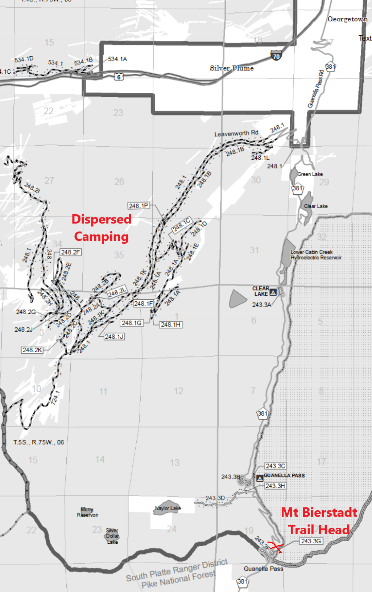
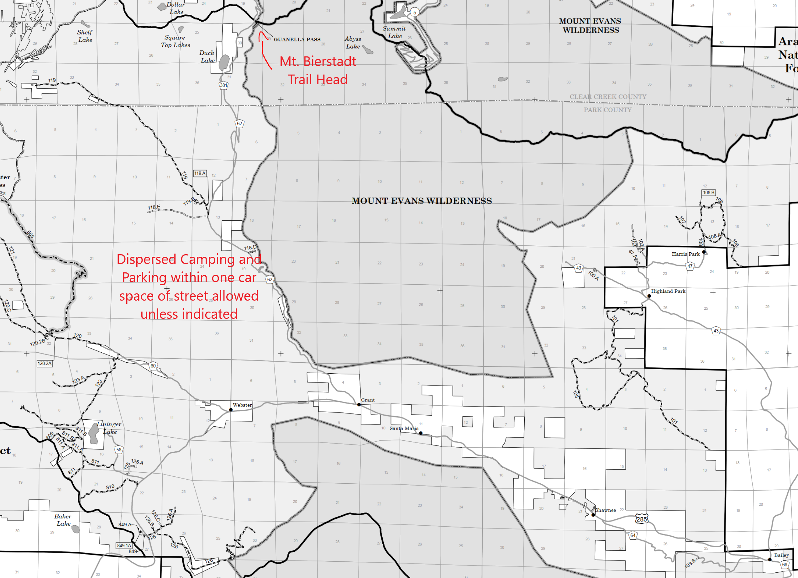

# Mount Bierstadt Hiking Trip

[Mt. Bierstadt](https://goo.gl/maps/Vn9ykUGWyS393eeM6) is a 14er (14,065 ft) of moderate
difficulty and distance which very close to the more accessible [Mt. Blue Sky](Link) (14,TODO ft).
Both peaks can be accessed from the west via a moderately difficult half day hike from the
western side of the mountain. The trail head is south of Georgetown off of I-70 and has
many opportunities for campgrounds, dispersed camping, small mountain lakes, deep forest hikes,
and the Guanella Pass (381) accessing the South Platte Ranger District of Pike National Forest. 

This is not the traditional access point for the Blue Sky peak and wilderness area and should
provide a less populated and more unique way to access the natural resources. 

### To Peak Statistics:

- **Distance:** 7.8 mi

- **Vertical:** +2,765 ft

- **Est Time:** 5h 10m

### Links:

- [AllTrails](TODO)
- [14ers.com](https://www.14ers.com/route.php?route=bier1)
- [The Next Summit](https://thenextsummit.org/14ers-in-colorado/hiking-mount-bierstadt/)

----

_A Note on Naming:_

The natural beauty ot the Mt. Evans area paired with a hard-working and well-designed national
forest infrastructure makes this area a treasure to respect. Out of this respect to the lands and
all of its people, this will be the last time this documents naming will involve the namesake of
Colorado's second governor, [John Evans](https://en.wikipedia.org/wiki/John_Evans_(Colorado_governor)).
Regardless of how you may judge him as a person of his time, his involvement in the Sand Creek massacre
more than warrants the [first nations' request](https://www.rmpbs.org/blogs/news/mount-evans-renaming-mount-blue-sky/)
to no longer honor his name by association with this land.

**Blue Sky** is the current front-runner for replacement and is magnificent on many levels so it will
replace the former governor in all instances. **Unfortunately official documents/signage will not
reflect this change so do be aware!**

----

## Camping

**From Georgetown:**

**From Bailey:**

