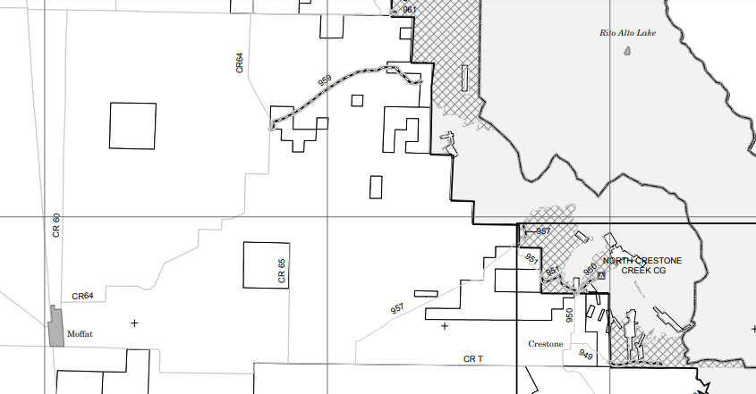

# San Luis Valley Colorado [WIP]

## Travel Times

Getting to activites in the valley generally takes **4hr**
from Denver. Different activites can be **0.5-2.0hr** from
each other within the valley.

Travelling into the valley from Denver can be accomplished
coming in from the north using the mountain 285 route or
go south using the interstate via I25 and then west 160.
The mountain route is often shorter and more enjoyable but
can be clogged to a standstill, especially on a Sunday. 
The I25 route is longer and involves the worst driving in
CO but is realible in weather and holiday traffic.

Here is a list of travel times:

**Denver (via Salida on 285)**
- [Salida](https://goo.gl/maps/aadKAsYThDNRzn5k8): 2.5hr 142 miles
- [Moffat](https://goo.gl/maps/4hLieq9vtgS8f4JDA): 3.2hr 181 miles
- [Saguache](): 
- [La Garita](https://goo.gl/maps/hNsG33SdeGreAXgJ7):
- [Crestone](https://goo.gl/maps/DkkM3irzvkh3uNSD7): 3.5hr 194 miles
- [Sand Dunes](https://goo.gl/maps/YEcnWdPScH4zd7ZN6): 3.8hr 223 miles
- [Alamosa](https://goo.gl/maps/L5ayQ3UxRjCtfYt28): 3.7hr 218 miles
- [Del Norte]():

**Denver (via Walsenburg on I25+160)**
- [Walsenburg](https://goo.gl/maps/JQucZqEYGEys9VqD9): 2.4hr 163 miles
- [Fort Garland](https://goo.gl/maps/F9W7kCYy4ytCYDNv6): 3.2hr 210 miles
- [Sand Dunes](https://goo.gl/maps/YEcnWdPScH4zd7ZN6): 3.5hr 237 miles
- [Alamosa](https://goo.gl/maps/L5ayQ3UxRjCtfYt28): 3.5hr 235 miles
- [Del Norte]():

**Crestone**
- [Sand Dunes]():
- [Lake Como Rd]():
- [Alamosa](https://goo.gl/maps/L5ayQ3UxRjCtfYt28):
- [Del Norte]():

**Del Norte**'
- [Crestone](https://goo.gl/maps/DkkM3irzvkh3uNSD7):
- [Alamosa](https://goo.gl/maps/L5ayQ3UxRjCtfYt28):
- [South Fork]():
- [Wheeler Geological Area]():
- [Creede]():

## Notes

### A. Mt. Crestone

**Camping:**

- North Crestone Creek Campground (FIRE?)
- Dispersed (FIRE?)
  
**Hiking:**

- Start ~8500 ft
- [Willow Creek Trailhead](https://goo.gl/maps/ZvX8pLDXAk3oedE38)
    - Willow Lake (11,500) 10.2 miles 5.5hrs
    - Kit Carlson (14,174) 12.3 miles 8hrs
- [Comanche Trailhead](https://goo.gl/maps/DCKa3p2oJowBjUAn8)
    - North Crestone Creek (11,815) 11.3 miles 6hr [Lake]
    - North Fork Trail (~12000) ~11 miles 6hr [Peaks]
  
**Buddhist Sites:**

- [Sangdo Palri Temple of Wisdom and Compassion](http://www.mangalashribhuti.org/)
- [Yeshe Rangsal Stupa](https://tsoknyirinpoche.org/yeshe-rangsal/stupa-and-shrine-hall/)
- [Tashi Gomang Stupa](https://kttg.org/)
- [Crestone Mountain Zen Center](https://www.dharmasangha.org/)

### B. Sand Dunes Park

TODO Pic dunes backcamping

TODO Pic Ellingwood point

**National Park:**

https://www.nps.gov/grsa/index.htm

Entrance Fees:

- Non-Commercial Vehicle and Occupants - $25.00
    - Passenger vehicle with all occupants
    - fee valid for 7 days.
- Oversized Vehicle, 15+ passengers, age 16+ - $15.00
    - Per passenger, 16 years and older in oversized vehicle, including 15 passenger vans, small buses, etc.
    - Valid for 7 days.
    - Passengers under 16 are free.
- Motorcycle and Riders - $20.00
    - One motorcycle and all its riders; valid for 7 days.

Visiting Center Hours:  9:00 AM - 4:30 PM

**Camping:**

- Visit from Crestone campsite (1hr one way)
- Medano Creek Dispersed (4WD)
    - 21 Sites 
    - 4x4 Required (~20-30 min one way to shuttle) 
    - https://www.nps.gov/grsa/planyourvisit/medano-pass-road.htm
- Zapata Falls Campground
    - ~20 min from Dunes
    - Popular but may have a space available

**Hiking:**

- Start ~7800 ft
- Dunes:
    - Cost ?
- [Lake Como Rd](https://goo.gl/maps/mnHTRoXs8J9R8iAr7)
    - Lake Como () 8.3 miles 5hr
    - Ellingwood Point (14066) 14.0 miles 8.7hr
    - Blanca (14345) + Little Bear (14036) 12.5 miles

### C. Wheeler Geological Area

TODO Hike/Road Map

- [Area Website](https://www.fs.usda.gov/recarea/riogrande/recarea/?recid=29264)

Wheeler is accessible by a **7 mile hike** or a grueling **14 mile four wheel drive road**.

- Camping: ?
    - TODO Cathedral campground

### D. Saguache 

TODO Mountain pick

TODO 114 Map

TODO 41G Map

**Camping:**

Many small established campgrounds with dispersed camping rounds in between.
The La Garita wilderness is located southwest of Saguache at the end of the
national forest in this region.

_From Saguache_

- [Buffalo Pass](https://goo.gl/maps/MxSwRvY5Jmy1fRJj9): 28 min 27 miles
    - https://www.fs.usda.gov/recarea/riogrande/recarea/?recid=29300
    - 19 sites  
- [Luders Creek](https://goo.gl/maps/QLrB1bPKCjRPUuTz9): 45 min 30 miles
    - https://www.fs.usda.gov/recarea/riogrande/recarea/?recid=29362
    - 5 sites   
- [Big Springs Picknick Area](https://goo.gl/maps/gvPJP8nmZSqARMv57)
    - Has water and facilaties 

_From [La Garita](https://goo.gl/maps/hNsG33SdeGreAXgJ7)_

- [Penitente Canyon](https://goo.gl/maps/nsWyxmHk1pMAjnrs7):
    - https://www.fs.usda.gov/recarea/riogrande/recarea/?recid=64790
    - Climbing Spot with room for camping 
- [Poso](https://goo.gl/maps/VTR1iazvKgQ2mzBp6): 23 min 13 miles
- [Storm King](https://goo.gl/maps/XcLQfmSLQ8xPMY2y5): 35 min 15 miles
    - https://www.fs.usda.gov/recarea/riogrande/recarea/?recid=78581
    - Two picnic sites

TODO Camping STONE CELLAR

### E. (TODO Central Valley)
